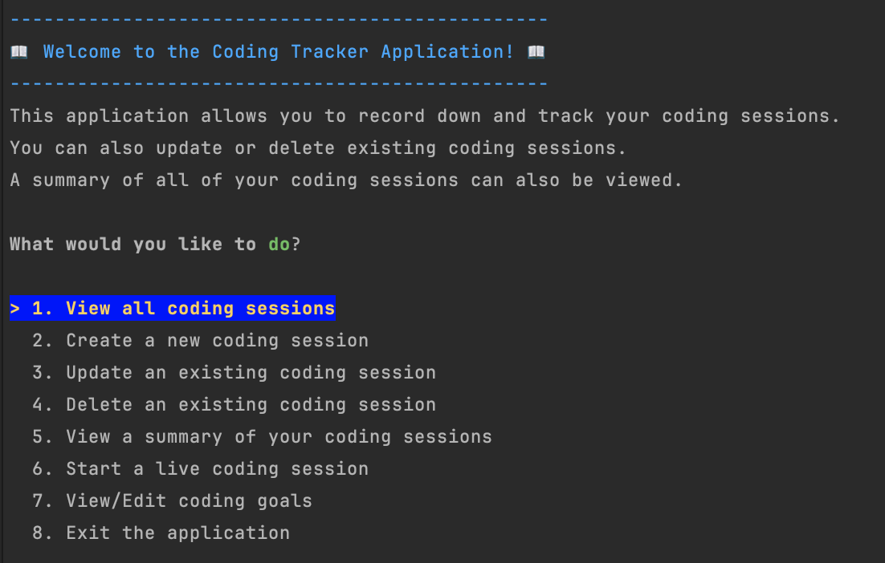
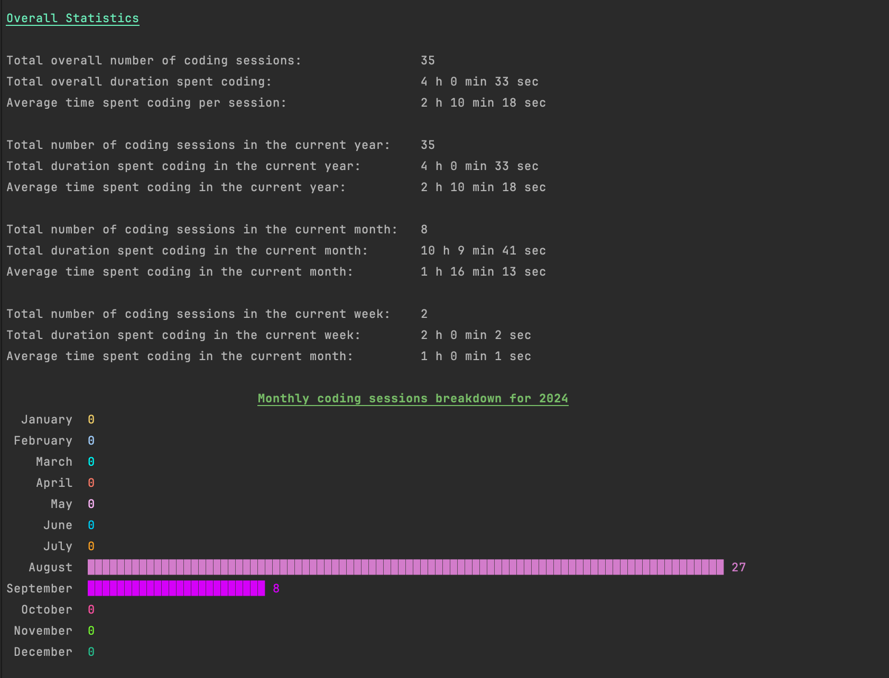

# Coding Tracker

This application is a C# console application where users can view, insert,
update and delete sessions of time when he spent coding. Users can also view a report of his
coding sessions which summarises some key statistics of the time he spent coding. The application
is written in C# with SQLite as the database. Spectre.Console is used beautify the inputs and outputs
of this application. Dapper is used as the ORM for data access from Sqlite.

# Given Requirements
- "Spectre.Console" library is used to show data on the console.
- Separate classes must be placed in different files (ex. UserInput.cs, Validation.cs, CodingController.cs)
- The user must be told the specific format which the date and time will be logged and not allow any other format.
- A configuration file must be created to contain the database path and connection strings.
- A "CodingSession" class must be created in a separate file. 
It will contain the properties of the coding session: Id, StartTime, EndTime, Duration
- The user shouldn't input the duration of the session. It should be calculated based on the Start and End times, in a separate "CalculateDuration" method.
- The user should be able to input the start and end times manually.
- The Dapper ORM must be used for the data access instead of ADO.NET.
- When reading from the database, an anonymous object cannot be used, the table must be read into a List of Coding Sessions.

# Features

* SQLite Database connection
    - The application used SQLite as its database
    - The information is stored locally in the `coding_tracker.db` file
    - On program startup, if the database does not exist and/or the table(s) does not exist,
      the database and/or the table(s) will be created and seeded with random information

* A console-based UI where users can navigate using commands from the keyboard
    - 

* CRUD DB functions
    * Users can create, read, update and delete coding sessions from the UI
    * Information inputted are checked for correct format
    * Users can also create, read, update and delete goals for coding (for e.g. how many hours to code per week)

* Start a live coding session that tracks how long the user has spent coding and then
creat a new session when the user decides to stop coding

* Summarized report on the user's coding sessions
    * Users can view a report which summarizes their coding sessions:
      * time spent coding
      * number of coding sessions
      * average time spent per coding session
      * monthly breakdown of number of coding sessions
    * 